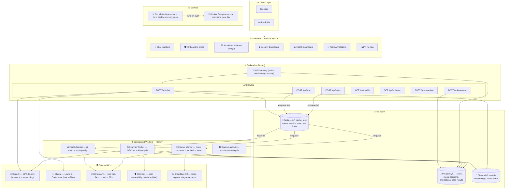
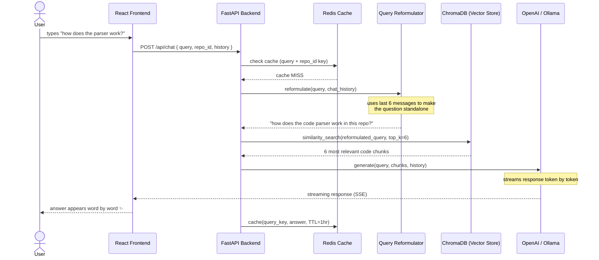
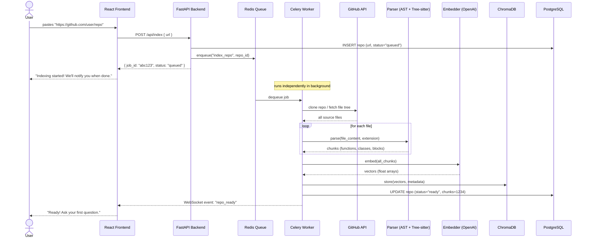
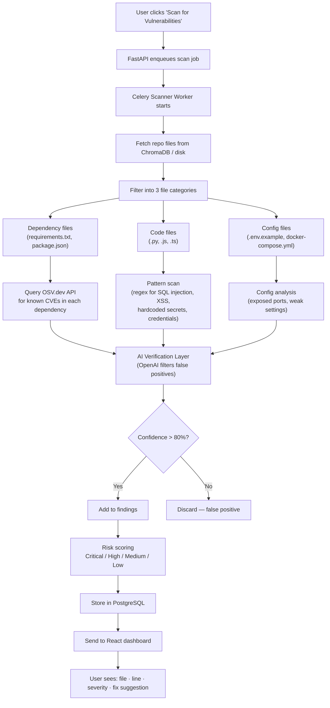

# Architecture & Feature Plan

> This document is your single source of truth for what we're building, why, and how.
> Read it top to bottom once. After that, use it as a reference.

---

## Table of Contents

1. [What Are We Building?](#1-what-are-we-building)
2. [Where We Are Now vs Where We're Going](#2-where-we-are-now-vs-where-were-going)
3. [The Build Roadmap](#3-the-build-roadmap)
4. [Full System Architecture](#4-full-system-architecture)
5. [How a Chat Request Works](#5-how-a-chat-request-works)
6. [How Repo Indexing Works](#6-how-repo-indexing-works)
7. [How the Security Scanner Works](#7-how-the-security-scanner-works)
8. [Full Feature List](#8-full-feature-list)
9. [Tech Stack](#9-tech-stack)
10. [System Design Concepts You'll Learn](#10-system-design-concepts-youll-learn)

---

## 1. What Are We Building?

A tool for developers who **actively work on a codebase** — not just tourists reading it for the first time.

| | repomind.in (existing) | Our Project |
|---|---|---|
| **Angle** | "I'm new here, explain this repo to me" | "I work here every day, help me go deeper" |
| **Models** | Gemini only | OpenAI + local Ollama (free, offline) |
| **Approach** | Agentic file selection | RAG + Agentic hybrid |
| **Security** | Basic scanner | Deep scanner + fix suggestions |
| **Onboarding** | None | Guided walkthrough mode |
| **Health Dashboard** | None | Complexity, coverage, hotspot files |
| **PR Review** | None | GitHub Actions integration |

---

## 2. Where We Are Now vs Where We're Going

### Right Now (Streamlit, Phase 1 complete)

```
┌─────────────────────────────────┐
│         Streamlit App           │
│  (UI + business logic + AI,     │
│   all in one app.py)            │
└──────────────┬──────────────────┘
               │
        ┌──────┴──────┐
        │   ChromaDB  │
        │  (vectors)  │
        └─────────────┘
```

**The problem:** everything is jammed into one process. Can't scale, can't have auth, can't run background jobs, can't handle multiple users at once.

---

### Where We're Going (Phase 3 target)

```
        Browser / Mobile PWA
               │
    ┌──────────▼──────────┐
    │   React + Next.js   │  ← replaces Streamlit UI
    │   (Frontend)        │
    └──────────┬──────────┘
               │  HTTP (REST / WebSocket)
    ┌──────────▼──────────┐
    │   FastAPI Backend   │  ← replaces Streamlit logic
    │   /api/chat         │
    │   /api/index        │
    │   /api/scan         │
    └──┬───────────────┬──┘
       │               │
┌──────▼──────┐  ┌─────▼──────────────┐
│ PostgreSQL  │  │  Redis             │
│ (users,     │  │  (cache + queue)   │
│  repos,     │  └─────┬──────────────┘
│  history)   │        │ dequeue jobs
└─────────────┘  ┌─────▼──────────────┐
                 │  Celery Workers    │
                 │  - Indexer         │
                 │  - Scanner         │
                 │  - Health          │
                 └─────┬──────────────┘
                       │
                ┌──────▼──────┐
                │   ChromaDB  │  ← keep this, it works
                │  (vectors)  │
                └─────────────┘
```

**Why this is better:**
- React can do auth, real-time updates, interactive graphs — Streamlit can't
- FastAPI separates UI from logic — the API can be called by a CLI or GitHub Actions too
- PostgreSQL stores users, sessions, annotations — ChromaDB can't do that
- Celery + Redis run heavy jobs (indexing, scanning) in the background — the app stays responsive
- Workers run independently — one slow job doesn't block everything else

---

## 3. The Build Roadmap

```
Phase 1 — Foundation                                              ✅ DONE
  Tests · CI (GitHub Actions) · Error Handling · Linting · Branch Protection

Phase 2 — Features on Streamlit                                   ← WE ARE HERE
  Goal: prove the features work BEFORE rebuilding the architecture
  ├── Rename the project                                           ← do this first
  ├── Security Scanner (OSV.dev + AI)                             ← start here
  ├── Onboarding Mode (guided walkthrough)
  ├── Real-time Transparency (show which files AI reads)
  └── Local Model Support (Ollama — free + offline)

Phase 3 — Real Architecture
  Goal: move off Streamlit onto proper foundation
  ├── FastAPI backend (migrate all logic from app.py)
  ├── React + Next.js frontend
  ├── PostgreSQL + GitHub OAuth auth
  ├── Celery + Redis (background jobs)
  └── Docker Compose (run everything with one command)

Phase 4 — Advanced Features
  Goal: differentiate completely
  ├── Codebase Health Dashboard (complexity, test coverage, hotspots)
  ├── PR Review Bot (GitHub webhook auto-comments)
  ├── Multi-repo support (ask questions across repos)
  ├── Team Annotations (pin notes on files)
  ├── Interactive Code Map (D3.js clickable graph)
  └── Cloud Deploy (Vercel + Railway)
```

---

## 4. Full System Architecture

> This shows every component in the final system and how they connect.
> Don't be intimidated — you'll build this one piece at a time.



---

## 5. How a Chat Request Works

> Step by step — what actually happens between you typing a question and seeing an answer.

**The key ideas here:**
- We first check the **cache** — if someone asked the same question before, return instantly
- We **reformulate** the question using chat history (so follow-up questions make sense)
- We search **ChromaDB** for the most relevant code chunks (this is the RAG part)
- The answer **streams back word by word** like ChatGPT — no waiting for the full response



---

## 6. How Repo Indexing Works

> What happens when you paste a GitHub URL and click "Index".

**The key idea:** indexing is slow (clone + parse + embed can take minutes for big repos).
So we **don't block the UI**. We immediately say "job started!" and hand the work to a background worker.
The UI gets notified via WebSocket when it's done.



---

## 7. How the Security Scanner Works

> How we find vulnerabilities in a repo using OSV.dev (free, open vulnerability database) + AI.

**The key idea:** three parallel scans — dependencies, code patterns, configs — then an AI layer filters out false positives before showing you anything.



---

## 8. Full Feature List

### Phase 2 — Building now (on Streamlit)

| Feature | What it does | How |
|---|---|---|
| **Security Scanner** | Find CVEs in dependencies, secrets in code | OSV.dev API + regex + OpenAI |
| **Onboarding Mode** | Guided walkthrough — entry points, reading order, glossary | LLM chaining |
| **Real-time Transparency** | Show which files AI picked and why | SSE streaming |
| **Local Model Support** | Use Ollama instead of OpenAI — free, offline | Ollama API |
| **Basic Health Metrics** | Git stats, file complexity overview | git log analysis |

### Phase 3 — Architecture rebuild

| Feature | What it does | How |
|---|---|---|
| **Background Indexing** | Index large repos without freezing the UI | Celery + Redis |
| **Response Caching** | Same question = instant answer | Redis TTL cache |
| **User Auth** | Login with GitHub, save your indexed repos | NextAuth / JWT |
| **Persistent History** | Save all chat conversations | PostgreSQL |
| **Streaming Responses** | Answers appear word by word | Server-Sent Events |
| **Rate Limiting** | Fair use — anonymous vs authenticated tiers | Redis counters |

### Phase 4 — Advanced

| Feature | What it does | How |
|---|---|---|
| **Interactive Code Map** | Clickable, zoomable graph of the codebase | D3.js / Cytoscape |
| **PR Review Bot** | Auto-comments on pull requests | GitHub Webhooks |
| **Health Dashboard** | Complexity, test coverage, hotspot files, bus factor | git log analysis |
| **Team Annotations** | Pin notes on files — tribal knowledge layer | PostgreSQL |
| **Multi-repo Support** | Ask questions across multiple repos | ChromaDB collections |
| **Blast Radius View** | "If I change this file, what breaks?" | Dependency graph |
| **Living Documentation** | Auto-generated docs, updated on every push | CI/CD + LLM |

---

## 9. Tech Stack

| Layer | Technology | Why we chose it |
|---|---|---|
| **Frontend** | React + Next.js | Industry standard. Streamlit can't do auth, real-time, or interactive graphs |
| **Backend** | FastAPI (Python) | Fast, async, auto-generates API docs. You already know Python |
| **AI — Cloud** | OpenAI GPT-4o-mini | Best quality answers, simple API |
| **AI — Local** | Ollama + Llama 3 | Free, runs on your machine, no internet needed — our differentiator |
| **Vector DB** | ChromaDB | Already built in, works great for code search |
| **Relational DB** | PostgreSQL | Best SQL DB. Free tier on Neon. Stores users, repos, history |
| **Cache + Queue** | Redis | Industry standard for both caching and task queues |
| **Task Queue** | Celery | Python-native worker system, plugs directly into Redis |
| **Security** | OSV.dev API | Free, open, comprehensive CVE database |
| **Auth** | GitHub OAuth + JWT | Users already have GitHub accounts |
| **File Storage** | Cloudflare R2 | Cheaper than AWS S3, same API |
| **CI/CD** | GitHub Actions | Already set up in Phase 1 |
| **Deploy** | Docker + Vercel/Railway | Containers for backend, managed hosting for frontend |
| **Diagrams** | Mermaid.js + D3.js | Mermaid for static diagrams, D3 for interactive code maps |

---

## 10. System Design Concepts You'll Learn

Every concept here is something you'll actually implement — not just read about.

| Concept | Where you'll build it |
|---|---|
| **Caching** | Redis for API responses (TTL 1hr) + ChromaDB as index cache |
| **Message Queue** | Redis + Celery: indexing jobs run in background, UI stays fast |
| **Load Balancing** | Multiple FastAPI + Celery worker instances (Phase 3) |
| **API Gateway** | FastAPI: routing, auth middleware, rate limiting |
| **SQL + NoSQL** | PostgreSQL (structured data) + ChromaDB (vector data) |
| **Event-Driven** | "repo indexed" → trigger security scan → notify user |
| **CAP Theorem** | Answer with partial index while still indexing (availability > consistency) |
| **Streaming** | Server-Sent Events for word-by-word AI responses |
| **Microservices** | Separate indexer/scanner/chat services (Phase 4) |
| **Blob Storage** | Cloudflare R2 for cloned repos, reports, diagram exports |
| **CDN** | Vercel serves frontend JS/CSS from nearest server globally |
| **Pub/Sub** | WebSocket: worker notifies UI when indexing job finishes |
| **Consistent Hashing** | ChromaDB sharding across nodes (Phase 4) |
| **Data Redundancy** | PostgreSQL daily backups + ChromaDB snapshots to R2 |

---

> **Next step:** Pick a project name, then we start Phase 2 with the Security Scanner.
