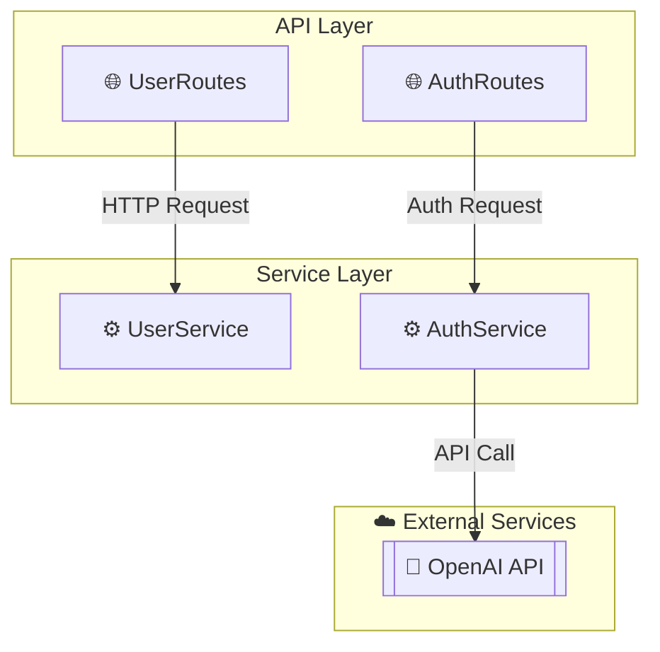

# RepoMind - Current State Documentation

> **Purpose:** This document provides A-Z comprehensive documentation of the RepoMind project for AI assistants (like GitHub Copilot) to understand the complete codebase before making modifications.

---

## Table of Contents

1. [Project Overview](#1-project-overview)
2. [Tech Stack](#2-tech-stack)
3. [File Structure](#3-file-structure)
4. [Configuration](#4-configuration)
5. [Component Details](#5-component-details)
6. [Data Flow](#6-data-flow)
7. [Data Structures](#7-data-structures)
8. [UI/App Structure](#8-uiapp-structure)
9. [Current Limitations](#9-current-limitations)
10. [Dependencies](#10-dependencies)

---

## 1. Project Overview

### What is RepoMind?

RepoMind is an AI-powered codebase Q&A and architecture visualization tool. It allows users to:

1. **Chat with any GitHub repository** — Ask natural language questions about code
2. **Generate architecture diagrams** — Auto-create professional dependency diagrams
3. **Get source citations** — Every answer includes file paths and line numbers

### Problem It Solves

- Developers spend hours understanding unfamiliar codebases
- Manual architecture documentation is tedious and outdated
- Traditional code search is keyword-based, not semantic

### Core Features

| Feature | Description |
|---------|-------------|
| GitHub Repo Ingestion | Clone any public repo, index all code files |
| Semantic Code Search | Find code by meaning, not just keywords |
| Conversational Q&A | Multi-turn chat with context preservation |
| Architecture Diagrams | LLM-powered Mermaid diagrams with layers |
| Source Citations | File paths + line numbers for every answer |
| Export Diagrams | Download as PNG/SVG |

---

## 2. Tech Stack

| Component | Technology | Version | Purpose |
|-----------|------------|---------|---------|
| **Frontend** | Streamlit | Latest | Web UI |
| **Vector Database** | ChromaDB | Latest | Store and search embeddings |
| **Embeddings** | OpenAI text-embedding-3-small | - | Convert text to vectors |
| **LLM** | GPT-4o-mini | - | Generate answers and analysis |
| **Code Parsing** | Python AST | Built-in | Smart code chunking |
| **Diagrams** | Mermaid.js | 10.6.1 | Render flowcharts |
| **Git Operations** | GitPython | Latest | Clone repositories |
| **Framework** | LangChain | Latest | LLM orchestration |

---

## 3. File Structure

```
repomind/
├── app.py                          # Main Streamlit application
├── config.py                       # Configuration and settings
├── requirements.txt                # Python dependencies
├── .env                            # Environment variables (API keys) - NOT in git
├── .env.example                    # Example environment file
├── .gitignore                      # Git ignore rules
├── README.md                       # Project documentation
│
├── ingestion/                      # Data ingestion pipeline
│   ├── __init__.py
│   ├── loader.py                   # Clone repos, read files
│   ├── parser.py                   # AST parsing, chunking
│   └── embedder.py                 # Vector embeddings, ChromaDB storage
│
├── retrieval/                      # Query processing pipeline
│   ├── __init__.py
│   ├── retriever.py                # Vector similarity search
│   ├── reformulator.py             # Query rewriting for follow-ups
│   └── context_builder.py          # Format context for LLM
│
├── generation/                     # Response generation
│   ├── __init__.py
│   └── generator.py                # LLM response generation
│
├── analysis/                       # Architecture analysis
│   ├── __init__.py
│   ├── dependency_parser.py        # Extract imports, classes, functions
│   ├── architecture_analyzer.py    # LLM-based architecture categorization
│   └── diagram_generator.py        # Mermaid diagram generation
│
├── storage/                        # ChromaDB persistence (gitignored)
│   └── {repo_name}/                # One folder per indexed repo
│
└── repos/                          # Cloned repositories (gitignored)
    └── {repo_name}/                # Actual repo files
```

---

## 4. Configuration

### File: `config.py`

```python
import os
from dotenv import load_dotenv

load_dotenv()

# API Keys
OPENAI_API_KEY = os.getenv("OPENAI_API_KEY")

# Model Settings
EMBEDDING_MODEL = "text-embedding-3-small"  # OpenAI embedding model
LLM_MODEL = "gpt-4o-mini"                   # OpenAI chat model

# Paths
REPOS_DIR = "repos"                         # Where cloned repos are stored
STORAGE_DIR = "storage"                     # Where ChromaDB data is stored

# Chunking Settings
CHUNK_SIZE = 1500                           # Max characters per chunk
CHUNK_OVERLAP = 200                         # Overlap between chunks

# Retrieval Settings
TOP_K = 6                                   # Number of chunks to retrieve

# Supported File Extensions
SUPPORTED_EXTENSIONS = [
    ".py", ".js", ".ts", ".jsx", ".tsx",
    ".java", ".go", ".rs", ".cpp", ".c",
    ".rb", ".php", ".swift", ".kt"
]

# Directories to Ignore
IGNORE_DIRS = [
    "node_modules", ".git", "__pycache__",
    "venv", ".venv", "dist", "build",
    ".next", ".nuxt", "vendor"
]
```

### Environment Variables (`.env`)

```
OPENAI_API_KEY=sk-your-api-key-here
```

---

## 5. Component Details

### 5.1 LOADER (`ingestion/loader.py`)

**Purpose:** Clone GitHub repositories and read all code files.

**Functions:**

```python
def clone_repo(github_url: str) -> str:
    """
    Clone a GitHub repository to local storage.
    
    Input: GitHub URL (e.g., "https://github.com/user/repo")
    Output: Local path (e.g., "repos/repo")
    
    Process:
    1. Extract repo name from URL
    2. Delete existing folder if exists
    3. Git clone using GitPython
    4. Return local path
    """

def get_all_files(repo_path: str) -> list[dict]:
    """
    Walk repository and return all supported code files.
    
    Input: Local repo path
    Output: List of file dictionaries
    
    Process:
    1. Recursively walk all directories
    2. Skip ignored directories (node_modules, .git, etc.)
    3. Filter by supported extensions (.py, .js, etc.)
    4. Read file content
    5. Return list of file dicts
    """

def load_repo(source: str) -> tuple[list[dict], str]:
    """
    Main entry point - load from GitHub URL or local path.
    
    Input: GitHub URL or local path
    Output: (list of files, repo name)
    """
```

**Output Data Structure:**

```python
[
    {
        "path": "src/main.py",           # Relative path from repo root
        "content": "import os\n...",     # Full file content as string
        "extension": ".py",              # File extension
        "name": "main.py"                # Filename only
    },
    # ... more files
]
```

---

### 5.2 PARSER (`ingestion/parser.py`)

**Purpose:** Split code files into meaningful chunks using AST for Python, simple chunking for others.

**Functions:**

```python
def parse_python_file(content: str, file_path: str) -> list[dict]:
    """
    Parse Python file using AST to extract functions and classes.
    
    Input: File content, file path
    Output: List of chunk dictionaries
    
    Process:
    1. Parse code into AST tree using ast.parse()
    2. Walk tree to find FunctionDef and ClassDef nodes
    3. Extract line numbers, names, docstrings
    4. Return list of chunks
    """

def simple_chunk(content: str, file_path: str) -> list[dict]:
    """
    Fallback chunking by character count.
    
    Input: File content, file path
    Output: List of chunk dictionaries
    
    Process:
    1. Split content into lines
    2. Accumulate lines until CHUNK_SIZE reached
    3. Create chunk with metadata
    4. Repeat until end of file
    """

def parse_file(content: str, file_path: str, extension: str) -> list[dict]:
    """
    Route to appropriate parser based on file type.
    
    - .py files → parse_python_file() (AST-based)
    - Other files → simple_chunk() (character-based)
    """

def parse_all_files(files: list[dict]) -> list[dict]:
    """
    Parse all files and return combined chunks.
    
    Input: List of files from loader
    Output: List of all chunks
    """
```

**Output Data Structure:**

```python
[
    {
        "content": "def login(user, pwd):\n    ...",  # Actual code
        "type": "function",                            # function, class, or code_block
        "name": "login",                               # Function/class name
        "file_path": "src/auth.py",                    # Source file
        "start_line": 10,                              # Starting line number
        "end_line": 25,                                # Ending line number
        "docstring": "Authenticate user credentials"   # Docstring if exists
    },
    # ... more chunks
]
```

**Key Technical Details:**

- Uses Python's built-in `ast` module
- `ast.parse(content)` converts code string to AST tree
- `ast.walk(tree)` iterates through all nodes
- `isinstance(node, ast.FunctionDef)` checks node type
- `node.lineno` and `node.end_lineno` give line numbers
- `ast.get_docstring(node)` extracts docstrings

---

### 5.3 EMBEDDER (`ingestion/embedder.py`)

**Purpose:** Convert text chunks to vectors and store in ChromaDB.

**Functions:**

```python
def get_embeddings():
    """
    Get OpenAI embedding model instance.
    
    Returns: OpenAIEmbeddings object configured with API key and model
    """

def create_vector_store(chunks: list[dict], collection_name: str) -> Chroma:
    """
    Embed chunks and store in ChromaDB.
    
    Input: List of chunks, collection name (repo name)
    Output: Chroma vector store object
    
    Process:
    1. Format each chunk with metadata for embedding
    2. Extract metadata separately
    3. Create Chroma vector store with persistence
    4. Return vector store
    """

def load_vector_store(collection_name: str) -> Chroma:
    """
    Load existing vector store from disk.
    
    Input: Collection name
    Output: Chroma vector store object
    """
```

**Embedding Text Format:**

Before embedding, each chunk is formatted as:

```
File: src/auth.py
Type: function | Name: login
Docstring: Authenticate user credentials

def login(user, pwd):
    return verify(user, pwd)
```

This enriches the embedding with metadata for better search.

**Storage Location:**

```
storage/
└── {collection_name}/
    ├── chroma.sqlite3      # Main database
    └── ...                 # Embedding files
```

---

### 5.4 RETRIEVER (`retrieval/retriever.py`)

**Purpose:** Search vector database for relevant code chunks.

**Class:**

```python
class Retriever:
    def __init__(self, collection_name: str):
        """
        Initialize retriever with a specific repo's vector store.
        
        Input: Collection name (repo name)
        """
        self.vector_store = load_vector_store(collection_name)
        self.collection_name = collection_name
    
    def search(self, query: str, top_k: int = TOP_K) -> list[dict]:
        """
        Semantic search for relevant chunks.
        
        Input: User query, number of results
        Output: List of chunks with scores
        
        Process:
        1. Embed query using same model
        2. Search ChromaDB for similar vectors
        3. Return top-k results with metadata
        """
    
    def search_with_filter(self, query: str, file_type: str = None) -> list[dict]:
        """
        Search with optional metadata filter.
        
        Can filter by: type (function, class), file extension, etc.
        """
```

**Output Data Structure:**

```python
[
    {
        "content": "def login(user, pwd):\n    ...",
        "file_path": "src/auth.py",
        "type": "function",
        "name": "login",
        "start_line": 10,
        "end_line": 25,
        "score": 0.082  # Lower = more similar
    },
    # ... more results
]
```

---

### 5.5 REFORMULATOR (`retrieval/reformulator.py`)

**Purpose:** Rewrite follow-up questions to be standalone.

**Problem Solved:**

```
User: "What is UserService?"
Bot: "UserService is a class that..."
User: "What methods does it have?"  ← "it" is ambiguous!

Reformulated: "What methods does the UserService class have?"
```

**Class:**

```python
class QueryReformulator:
    def __init__(self):
        """Initialize with LLM (GPT-4o-mini, temperature=0)."""
        self.llm = ChatOpenAI(model=LLM_MODEL, temperature=0)
    
    def reformulate(self, query: str, chat_history: list[dict]) -> str:
        """
        Reformulate query using chat history.
        
        Input: Current query, list of previous messages
        Output: Standalone query string
        
        Process:
        1. If no history, return query unchanged
        2. Build history string from last 6 messages
        3. Ask LLM to reformulate
        4. Return standalone question
        """
```

**Prompt Template:**

```
Given the conversation history and a follow-up question, reformulate the question to be standalone.

Chat History:
user: What is UserService?
assistant: UserService is a class that...

Follow-up Question: What methods does it have?

Reformulated Question (standalone, no explanation):
```

---

### 5.6 CONTEXT BUILDER (`retrieval/context_builder.py`)

**Purpose:** Format retrieved chunks into clean context for LLM.

**Functions:**

```python
def build_context(chunks: list[dict]) -> str:
    """
    Format chunks as markdown for LLM consumption.
    
    Input: List of chunks from retriever
    Output: Formatted markdown string
    """

def build_sources_list(chunks: list[dict]) -> list[dict]:
    """
    Extract deduplicated source references.
    
    Input: List of chunks
    Output: List of source dictionaries for citations
    """
```

**Output Format (build_context):**

```markdown
---
**Source 1:** `src/auth.py` (lines 10-25)
**Type:** function | **Name:** login

```python
def login(user, pwd):
    return verify(user, pwd)
```

---
**Source 2:** `src/auth.py` (lines 27-35)
**Type:** function | **Name:** verify

```python
def verify(user, pwd):
    return bcrypt.check(pwd, user.hash)
```
```

**Output Format (build_sources_list):**

```python
[
    {"file": "src/auth.py", "name": "login", "type": "function", "lines": "10-25"},
    {"file": "src/auth.py", "name": "verify", "type": "function", "lines": "27-35"}
]
```

---

### 5.7 GENERATOR (`generation/generator.py`)

**Purpose:** Generate final answer using LLM with retrieved context.

**Class:**

```python
class Generator:
    def __init__(self):
        """Initialize with LLM (GPT-4o-mini, temperature=0.1)."""
        self.llm = ChatOpenAI(model=LLM_MODEL, temperature=0.1)
        self.system_prompt = """You are a helpful code assistant...
        
        Rules:
        1. Answer based ONLY on provided code context
        2. Always reference specific files and line numbers
        3. If context doesn't have enough info, say so
        4. Be concise but thorough
        5. Use code snippets when helpful
        """
    
    def generate(self, query: str, chunks: list[dict], chat_history: list[dict] = None) -> dict:
        """
        Generate response using context.
        
        Input: Query, retrieved chunks, optional chat history
        Output: {"answer": str, "sources": list}
        
        Process:
        1. Build context from chunks
        2. Build sources list
        3. Construct messages (system + history + user)
        4. Call LLM
        5. Return answer and sources
        """
```

**Message Structure:**

```python
messages = [
    {"role": "system", "content": self.system_prompt},
    # ... chat history (last 6 messages)
    {"role": "user", "content": f"Context:\n{context}\n\nQuestion: {query}"}
]
```

---

### 5.8 DEPENDENCY PARSER (`analysis/dependency_parser.py`)

**Purpose:** Extract imports, classes, functions from codebase for architecture analysis.

**Functions:**

```python
def parse_imports(content: str) -> list[str]:
    """Extract all import statements from Python code."""

def parse_classes_and_functions(content: str) -> dict:
    """Extract class and function definitions with metadata."""

def find_entry_points(files: dict) -> list[str]:
    """Find entry point files (main.py, app.py, if __name__ == '__main__')."""

def build_dependency_graph(files: dict) -> list[dict]:
    """Build list of file-to-file dependencies based on imports."""

def analyze_repo(repo_path: str) -> dict:
    """
    Main entry point for repository analysis.
    
    Output: {
        "files": {filepath: {classes, functions, imports, is_entry_point}},
        "dependencies": [{from, to}],
        "entry_points": [filepaths],
        "modules": set of module names
    }
    """
```

---

### 5.9 ARCHITECTURE ANALYZER (`analysis/architecture_analyzer.py`)

**Purpose:** Use LLM to categorize components into layers and identify connections.

**Class:**

```python
class ArchitectureAnalyzer:
    def __init__(self):
        """Initialize with LLM (GPT-4o-mini, temperature=0)."""
        self.llm = ChatOpenAI(model=LLM_MODEL, temperature=0)
    
    def analyze(self, files_analysis: dict) -> dict:
        """
        Analyze codebase architecture using LLM.
        
        Input: Analysis from dependency_parser
        Output: {
            "layers": [{name, description, components: [{file, name, type, description}]}],
            "connections": [{from, to, label}],
            "external_services": [{name, type}]
        }
        """
    
    def _build_codebase_summary(self, files_analysis: dict) -> str:
        """Build text summary of codebase for LLM."""
    
    def _analyze_with_llm(self, codebase_summary: str) -> dict:
        """Send to LLM and parse JSON response."""
```

**LLM Prompt:**

```
Analyze this codebase and provide a structured architecture breakdown.

{codebase_summary}

Return a JSON object with this EXACT structure:
{
    "layers": [...],
    "connections": [...],
    "external_services": [...]
}

Rules:
1. Group files into logical layers (typically 3-5 layers)
2. Identify the ACTUAL data flow, not just imports
3. Include external services the code interacts with
4. Keep component names short but descriptive
5. Label connections with what actually flows between them
```

---

### 5.10 DIAGRAM GENERATOR (`analysis/diagram_generator.py`)

**Purpose:** Generate Mermaid flowchart code from architecture analysis.

**Functions:**

```python
def generate_professional_diagram(architecture: dict) -> str:
    """
    Generate Mermaid flowchart from architecture analysis.
    
    Input: Architecture dict from ArchitectureAnalyzer
    Output: Mermaid code string
    
    Features:
    - Subgraphs for each layer
    - Icons for component types
    - Labeled arrows for connections
    - Color-coded by type (api, service, database, etc.)
    """

def generate_architecture_description(analysis: dict) -> str:
    """
    Generate text description of architecture using LLM.
    
    Input: Analysis from dependency_parser
    Output: Markdown description
    """

def generate_smart_diagram(analysis: dict) -> tuple[str, dict]:
    """
    Main entry point - combines analyzer and diagram generation.
    
    Output: (mermaid_code, architecture_dict)
    """
```

**Mermaid Output Example:**



**Icon Mapping:**

```python
icons = {
    "api": "🌐",
    "service": "⚙️",
    "database": "🗄️",
    "config": "📝",
    "utils": "🔧",
    "model": "📊",
    "agent": "🤖",
    "scraper": "🕷️",
    "external": "☁️",
    "ai": "🧠",
    "storage": "💾",
    "email": "📧"
}
```

---

## 6. Data Flow

### 6.1 Ingestion Pipeline (One-time per repo)

```
GitHub URL
    │
    ▼
┌─────────────────────────────────────────────────────────────────┐
│ LOADER                                                          │
│ • Clone repo using GitPython                                    │
│ • Walk directories, filter by extension                         │
│ • Read file contents                                            │
│ Output: [{path, content, extension, name}, ...]                 │
└─────────────────────────────────────────────────────────────────┘
    │
    ▼
┌─────────────────────────────────────────────────────────────────┐
│ PARSER                                                          │
│ • Python files: AST parsing (extract functions, classes)        │
│ • Other files: Simple chunking (split by character count)       │
│ Output: [{content, type, name, file_path, start_line, ...}, ...]│
└─────────────────────────────────────────────────────────────────┘
    │
    ▼
┌─────────────────────────────────────────────────────────────────┐
│ EMBEDDER                                                        │
│ • Format chunks with metadata                                   │
│ • Send to OpenAI Embeddings API                                 │
│ • Store vectors + metadata in ChromaDB                          │
│ • Persist to disk                                               │
│ Output: ChromaDB collection at storage/{repo_name}/             │
└─────────────────────────────────────────────────────────────────┘
```

### 6.2 Query Pipeline (Every question)

```
User Question: "How does authentication work?"
    │
    ▼
┌─────────────────────────────────────────────────────────────────┐
│ REFORMULATOR                                                    │
│ • Check if follow-up question                                   │
│ • Use chat history to make standalone                           │
│ Output: "How does authentication work?" (or reformulated)       │
└─────────────────────────────────────────────────────────────────┘
    │
    ▼
┌─────────────────────────────────────────────────────────────────┐
│ RETRIEVER                                                       │
│ • Embed query using OpenAI                                      │
│ • Search ChromaDB for similar vectors                           │
│ • Return top-k chunks with scores                               │
│ Output: [{content, file_path, name, score, ...}, ...]           │
└─────────────────────────────────────────────────────────────────┘
    │
    ▼
┌─────────────────────────────────────────────────────────────────┐
│ CONTEXT BUILDER                                                 │
│ • Format chunks as markdown                                     │
│ • Build sources list (deduplicated)                             │
│ Output: (context_string, sources_list)                          │
└─────────────────────────────────────────────────────────────────┘
    │
    ▼
┌─────────────────────────────────────────────────────────────────┐
│ GENERATOR                                                       │
│ • Build message array (system + history + context + query)      │
│ • Call GPT-4o-mini                                              │
│ • Return answer with sources                                    │
│ Output: {"answer": "...", "sources": [...]}                     │
└─────────────────────────────────────────────────────────────────┘
    │
    ▼
Display answer + source citations to user
```

### 6.3 Architecture Analysis Pipeline

```
Repository Path
    │
    ▼
┌─────────────────────────────────────────────────────────────────┐
│ DEPENDENCY PARSER                                               │
│ • Parse all Python files for imports                            │
│ • Extract classes, functions, docstrings                        │
│ • Identify entry points                                         │
│ • Build dependency graph                                        │
│ Output: {files, dependencies, entry_points, modules}            │
└─────────────────────────────────────────────────────────────────┘
    │
    ▼
┌─────────────────────────────────────────────────────────────────┐
│ ARCHITECTURE ANALYZER                                           │
│ • Build codebase summary                                        │
│ • Send to LLM for categorization                                │
│ • Parse JSON response                                           │
│ Output: {layers, connections, external_services}                │
└─────────────────────────────────────────────────────────────────┘
    │
    ▼
┌─────────────────────────────────────────────────────────────────┐
│ DIAGRAM GENERATOR                                               │
│ • Generate Mermaid flowchart code                               │
│ • Add subgraphs for layers                                      │
│ • Add icons and colors                                          │
│ • Add labeled connections                                       │
│ Output: Mermaid code string                                     │
└─────────────────────────────────────────────────────────────────┘
    │
    ▼
Render in Streamlit using HTML component with Mermaid.js CDN
```

---

## 7. Data Structures

### 7.1 File Dict (from Loader)

```python
{
    "path": str,        # "src/main.py"
    "content": str,     # Full file content
    "extension": str,   # ".py"
    "name": str         # "main.py"
}
```

### 7.2 Chunk Dict (from Parser)

```python
{
    "content": str,      # Code content
    "type": str,         # "function" | "class" | "code_block"
    "name": str,         # Name of function/class/block
    "file_path": str,    # Source file path
    "start_line": int,   # Starting line number
    "end_line": int,     # Ending line number
    "docstring": str     # Docstring if exists, else ""
}
```

### 7.3 Search Result (from Retriever)

```python
{
    "content": str,
    "file_path": str,
    "type": str,
    "name": str,
    "start_line": int,
    "end_line": int,
    "score": float       # Similarity score (lower = better)
}
```

### 7.4 Generator Response

```python
{
    "answer": str,       # LLM-generated answer
    "sources": [         # List of source citations
        {
            "file": str,
            "name": str,
            "type": str,
            "lines": str  # "10-25"
        }
    ]
}
```

### 7.5 Architecture Analysis

```python
{
    "files": {
        "path/to/file.py": {
            "classes": [{"name": str, "methods": [...], "docstring": str}],
            "functions": [{"name": str, "args": [...], "docstring": str}],
            "imports": [str],
            "is_entry_point": bool
        }
    },
    "dependencies": [
        {"from": str, "to": str}
    ],
    "entry_points": [str],
    "modules": set
}
```

### 7.6 Architecture (from Analyzer)

```python
{
    "layers": [
        {
            "name": str,          # "API Layer"
            "description": str,
            "components": [
                {
                    "file": str,
                    "name": str,
                    "type": str,  # "api" | "service" | "database" | etc.
                    "description": str
                }
            ]
        }
    ],
    "connections": [
        {
            "from": str,     # Component name
            "to": str,       # Component name
            "label": str     # "HTTP Request" | "DB Query" | etc.
        }
    ],
    "external_services": [
        {
            "name": str,     # "OpenAI API"
            "type": str      # "ai" | "database" | "email" | etc.
        }
    ]
}
```

---

## 8. UI/App Structure

### 8.1 Streamlit App Layout (`app.py`)

```
┌─────────────────────────────────────────────────────────────────┐
│                         HEADER                                  │
│                    "RepoMind" + tagline                         │
├─────────────────┬───────────────────────────────────────────────┤
│                 │                                               │
│    SIDEBAR      │              MAIN CONTENT                     │
│                 │                                               │
│ ┌─────────────┐ │  ┌─────────────────────────────────────────┐  │
│ │ API Key     │ │  │            TAB: Chat                    │  │
│ │ Input       │ │  │  ┌─────────────────────────────────┐    │  │
│ └─────────────┘ │  │  │     Chat Messages               │    │  │
│                 │  │  │     (user + assistant)          │    │  │
│ ┌─────────────┐ │  │  └─────────────────────────────────┘    │  │
│ │ GitHub URL  │ │  │  ┌─────────────────────────────────┐    │  │
│ │ Input       │ │  │  │     Sources (expandable)        │    │  │
│ └─────────────┘ │  │  └─────────────────────────────────┘    │  │
│                 │  │  ┌─────────────────────────────────┐    │  │
│ [Load & Index]  │  │  │     Chat Input                  │    │  │
│                 │  │  └─────────────────────────────────┘    │  │
│ ┌─────────────┐ │  └─────────────────────────────────────────┘  │
│ │ Indexed     │ │                                               │
│ │ Repos List  │ │  ┌─────────────────────────────────────────┐  │
│ │             │ │  │         TAB: Architecture               │  │
│ │ • repo1     │ │  │  [Analyze Architecture]                 │  │
│ │ • repo2     │ │  │  ┌─────────────────────────────────┐    │  │
│ │             │ │  │  │     Mermaid Diagram             │    │  │
│ └─────────────┘ │  │  │     [Export PNG] [Export SVG]   │    │  │
│                 │  │  └─────────────────────────────────┘    │  │
│                 │  │  ┌──────────────┬──────────────────┐    │  │
│                 │  │  │ Architecture │ External Services│    │  │
│                 │  │  │ Overview     │                  │    │  │
│                 │  │  └──────────────┴──────────────────┘    │  │
│                 │  │  │  Layer Breakdown (expandable)  │    │  │
│                 │  │  └─────────────────────────────────┘    │  │
│                 │  └─────────────────────────────────────────┘  │
└─────────────────┴───────────────────────────────────────────────┘
```

### 8.2 Session State Variables

```python
# Stored in st.session_state:

st.session_state["openai_api_key"]   # User's API key
st.session_state["repo_name"]        # Current repo name
st.session_state["repo_path"]        # Path to cloned repo
st.session_state["messages"]         # Chat history [{role, content}, ...]
st.session_state["indexed_repos"]    # List of indexed repo names
st.session_state["analysis"]         # Dependency analysis results
st.session_state["flowchart"]        # Mermaid diagram code
st.session_state["architecture"]     # Architecture analysis results
st.session_state["description"]      # Architecture text description
```

### 8.3 Key UI Functions

```python
def render_mermaid(mermaid_code: str):
    """
    Render Mermaid diagram using HTML component.
    
    - Uses Mermaid.js CDN (v10.6.1)
    - Dark theme with custom colors
    - Export buttons for PNG/SVG
    - Embedded in iframe via components.html()
    """

# CSS Styling:
# - Dark gradient background (#0f0f1a → #1a1a2e → #16213e)
# - Glassmorphism effect for cards
# - Inter font family
# - Custom chat bubble styles
```

### 8.4 User Flow

```
1. User enters OpenAI API key (sidebar)
2. User pastes GitHub URL (sidebar)
3. User clicks "Load & Index"
   → Loader clones repo
   → Parser chunks files
   → Embedder creates vectors
   → Success message shown
4. User switches to Chat tab
5. User types question
   → Reformulator processes
   → Retriever searches
   → Generator answers
   → Response + sources displayed
6. User switches to Architecture tab
7. User clicks "Analyze Architecture"
   → Dependency parser runs
   → Architecture analyzer categorizes
   → Diagram generator creates Mermaid
   → Diagram + description displayed
8. User clicks Export PNG/SVG
   → JavaScript converts SVG to image
   → Download triggered
```

---

## 9. Current Limitations

### 9.1 Parsing Limitations

| Limitation | Description | Impact |
|------------|-------------|--------|
| **Python-only AST** | Only Python files get smart AST parsing | JS, TS, Java files use basic chunking, lose function boundaries |
| **Syntax errors** | AST fails on invalid Python | Falls back to simple chunking |
| **Large functions** | Functions > CHUNK_SIZE not split further | May exceed context limits |

### 9.2 Retrieval Limitations

| Limitation | Description | Impact |
|------------|-------------|--------|
| **Basic similarity search** | Only semantic search, no keyword matching | Misses exact matches like class names |
| **No reranking** | Returns top-k directly | May miss better results ranked lower |
| **Single query** | One search per question | Doesn't explore query variations |

### 9.3 Architecture Analysis Limitations

| Limitation | Description | Impact |
|------------|-------------|--------|
| **LLM-dependent** | Architecture categorization relies on LLM guessing | May misclassify components |
| **Python imports only** | Only parses Python import statements | Misses JS/TS dependencies |
| **No call graph** | Shows file dependencies, not function calls | Limited detail |

### 9.4 UI/UX Limitations

| Limitation | Description |
|------------|-------------|
| **No chat persistence** | Chat history lost on refresh |
| **Single repo at a time** | Can't compare multiple repos |
| **No file browser** | Can't explore repo structure visually |

---

## 10. Dependencies

### 10.1 `requirements.txt`

```
langchain
langchain-openai
langchain-chroma
chromadb
openai
streamlit
gitpython
python-dotenv
```

### 10.2 External Services

| Service | Purpose | Required |
|---------|---------|----------|
| **OpenAI API** | Embeddings + LLM | Yes |
| **GitHub** | Clone public repos | Yes (for remote repos) |

### 10.3 CDN Dependencies (in app.py)

| Library | Version | Purpose |
|---------|---------|---------|
| Mermaid.js | 10.6.1 | Render diagrams |

---

## 11. Key Code Patterns

### 11.1 LangChain Usage

```python
# Embeddings
from langchain_openai import OpenAIEmbeddings
embeddings = OpenAIEmbeddings(model="text-embedding-3-small", openai_api_key=KEY)

# LLM
from langchain_openai import ChatOpenAI
llm = ChatOpenAI(model="gpt-4o-mini", temperature=0.1, openai_api_key=KEY)

# Vector Store
from langchain_chroma import Chroma
vector_store = Chroma.from_texts(texts, embeddings, persist_directory=path)
```

### 11.2 AST Parsing Pattern

```python
import ast

tree = ast.parse(content)
for node in ast.walk(tree):
    if isinstance(node, ast.FunctionDef):
        # Extract function info
        name = node.name
        start_line = node.lineno
        end_line = node.end_lineno
        docstring = ast.get_docstring(node)
```

### 11.3 Streamlit Patterns

```python
# Session state
if "key" not in st.session_state:
    st.session_state["key"] = default_value

# Tabs
tab1, tab2 = st.tabs(["Chat", "Architecture"])
with tab1:
    # Chat content
with tab2:
    # Architecture content

# HTML components
import streamlit.components.v1 as components
components.html(html_content, height=600)
```

---

## 12. Testing the Application

### 12.1 Running Locally

```bash
# 1. Navigate to project
cd repomind

# 2. Activate virtual environment
source venv/bin/activate

# 3. Set environment variable
export OPENAI_API_KEY=sk-your-key

# 4. Run app
streamlit run app.py

# 5. Open browser
# http://localhost:8501
```

### 12.2 Testing Ingestion

```python
# Test loader
from ingestion.loader import load_repo
files, name = load_repo("https://github.com/user/repo")
print(f"Loaded {len(files)} files from {name}")

# Test parser
from ingestion.parser import parse_all_files
chunks = parse_all_files(files)
print(f"Created {len(chunks)} chunks")

# Test embedder
from ingestion.embedder import create_vector_store
vector_store = create_vector_store(chunks, name)
print("Vector store created")
```

### 12.3 Testing Retrieval

```python
# Test retriever
from retrieval.retriever import Retriever
retriever = Retriever("repo_name")
results = retriever.search("How does authentication work?")
for r in results:
    print(f"{r['name']} in {r['file_path']} (score: {r['score']:.3f})")
```

### 12.4 Testing Architecture

```python
# Test dependency parser
from analysis.dependency_parser import analyze_repo
analysis = analyze_repo("repos/repo_name")
print(f"Found {len(analysis['files'])} files")
print(f"Entry points: {analysis['entry_points']}")

# Test diagram generator
from analysis.diagram_generator import generate_smart_diagram
diagram, arch = generate_smart_diagram(analysis)
print(diagram)  # Mermaid code
```

---

## Summary

RepoMind is a complete RAG application with:

- **Ingestion Pipeline:** LOADER → PARSER → EMBEDDER → ChromaDB
- **Query Pipeline:** REFORMULATOR → RETRIEVER → CONTEXT BUILDER → GENERATOR
- **Architecture Pipeline:** DEPENDENCY PARSER → ARCHITECTURE ANALYZER → DIAGRAM GENERATOR

**Current State:** Fully functional with Python AST parsing, basic semantic search, and LLM-powered architecture diagrams.

**Next Improvements:** Tree-sitter multi-language parsing, hybrid search, reranking, contextual retrieval.

---

*Last Updated: Current Session*
*GitHub: https://github.com/Samartha217/repomind*│  │  │     Architecture Layers        │    │  │
│                 │  │  └─────────────────────────────────┘    │  │
│                 │  └─────────────────────────────────────────┘  │
└─────────────────┴───────────────────────────────────────────────┘
```

### 8.2 Session State Variables

```python
# Streamlit session state used throughout the app:

st.session_state["openai_api_key"]    # User's API key (optional, for deployment)
st.session_state["repo_name"]         # Currently selected repo name
st.session_state["repo_path"]         # Path to cloned repo
st.session_state["vector_store"]      # Loaded ChromaDB vector store
st.session_state["chat_history"]      # List of {role, content} messages
st.session_state["indexed_repos"]     # List of available indexed repos
st.session_state["analysis"]          # Dependency parser output
st.session_state["architecture"]      # Architecture analyzer output
st.session_state["flowchart"]         # Mermaid diagram code
st.session_state["description"]       # Architecture description text
```

### 8.3 Key UI Functions

```python
def render_mermaid(mermaid_code: str):
    """
    Render Mermaid diagram using HTML component.
    
    - Uses Mermaid.js CDN (v10.6.1)
    - Dark theme with custom colors
    - Export buttons for PNG/SVG
    - Scrollable container
    """

def get_indexed_repos() -> list[str]:
    """Get list of repos in storage/ directory."""

# Main flow in app.py:
# 1. Set page config and inject CSS
# 2. Define render_mermaid function
# 3. Build sidebar (API key, repo input, repo list)
# 4. Build main content with tabs
# 5. Tab 1: Chat interface with message display and input
# 6. Tab 2: Architecture analysis with diagram and breakdown
```

### 8.4 Mermaid Rendering

The diagram is rendered using an HTML component with Mermaid.js:

```python
html_content = f"""
<!DOCTYPE html>
<html>
<head>
    <script src="https://cdn.jsdelivr.net/npm/mermaid@10.6.1/dist/mermaid.min.js"></script>
</head>
<body>
    <div class="controls">
        <button onclick="exportPNG()">📥 Export as PNG</button>
        <button onclick="exportSVG()">📥 Export as SVG</button>
    </div>
    <div class="mermaid">
        {mermaid_code}
    </div>
    <script>
        mermaid.initialize({{
            startOnLoad: true,
            theme: 'dark',
            // ... theme variables
        }});
        
        function exportPNG() {{ /* canvas conversion logic */ }}
        function exportSVG() {{ /* SVG serialization logic */ }}
    </script>
</body>
</html>
"""
components.html(html_content, height=700, scrolling=True)
```

---

## 9. Current Limitations

### 9.1 Parsing Limitations

| Limitation | Description | Impact |
|------------|-------------|--------|
| **Python-only AST** | Only Python files get smart AST parsing | JS, TS, Java files use basic character-based chunking |
| **No nested function handling** | Nested functions may be extracted separately | Some context loss |
| **Syntax errors fail silently** | Files with syntax errors fall back to simple chunking | May miss function boundaries |

### 9.2 Retrieval Limitations

| Limitation | Description | Impact |
|------------|-------------|--------|
| **Basic semantic search only** | No keyword/BM25 component | Exact matches like "UserService" may rank lower than semantic matches |
| **No reranking** | Top-k returned directly | Could miss better results outside initial top-k |
| **Single query** | No query expansion or multi-query | Single perspective on relevance |
| **No contextual enrichment** | Chunks embedded as-is | Limited semantic understanding of code purpose |

### 9.3 Architecture Analysis Limitations

| Limitation | Description | Impact |
|------------|-------------|--------|
| **LLM-dependent** | Architecture categorization relies on LLM | May hallucinate or miscategorize |
| **Python imports only** | Dependency graph from Python imports | Non-Python dependencies not tracked |
| **No runtime analysis** | Static analysis only | Dynamic relationships not captured |

### 9.4 General Limitations

| Limitation | Description |
|------------|-------------|
| **No incremental indexing** | Must re-index entire repo on changes |
| **No authentication** | Only public repos supported |
| **Memory usage** | Large repos may exhaust memory |
| **Rate limits** | OpenAI API rate limits apply |

---

## 10. Dependencies

### 10.1 requirements.txt

```
langchain
langchain-openai
langchain-chroma
chromadb
openai
streamlit
gitpython
python-dotenv
```

### 10.2 External Services

| Service | Purpose | Required |
|---------|---------|----------|
| **OpenAI API** | Embeddings + LLM | Yes |
| **GitHub** | Clone repositories | Yes (for GitHub URLs) |

### 10.3 CDN Dependencies (Frontend)

| Resource | Version | Purpose |
|----------|---------|---------|
| Mermaid.js | 10.6.1 | Diagram rendering |

---

## 11. Key Technical Concepts

### 11.1 RAG (Retrieval-Augmented Generation)

```
Traditional LLM:
Question → LLM (uses training data only) → Answer

RAG:
Question → Retrieve relevant docs → LLM (uses docs + training) → Answer
```

**Why RAG for code?**
- LLM doesn't know YOUR codebase
- Retrieval grounds answers in actual code
- Reduces hallucination
- Enables citations

### 11.2 Vector Embeddings

```
Text: "def login(user, password):"
         │
         ▼ OpenAI API
         │
Vector: [0.021, -0.034, 0.089, ..., -0.045]  (1536 dimensions)
```

**Key insight:** Similar meanings → similar vectors → can search by meaning

### 11.3 AST (Abstract Syntax Tree)

```python
# Code:
def hello(name):
    return f"Hello {name}"

# AST:
Module
└── FunctionDef (name="hello", lineno=1, end_lineno=2)
    ├── args: [name]
    └── body: [Return]
```

**Why AST?** Extract functions/classes with exact boundaries, not arbitrary text splits.

### 11.4 ChromaDB

- **Vector database** optimized for similarity search
- **Persistence** to disk (survives restarts)
- **Metadata storage** alongside vectors
- **Fast retrieval** using approximate nearest neighbors

---

## 12. How Components Connect

```
┌─────────────────────────────────────────────────────────────────────────────┐
│                        COMPONENT CONNECTIONS                                │
└─────────────────────────────────────────────────────────────────────────────┘

app.py
  │
  ├── INGESTION (on "Load & Index" click)
  │   │
  │   ├── loader.load_repo(github_url)
  │   │   └── Returns: (files_list, repo_name)
  │   │
  │   ├── parser.parse_all_files(files_list)
  │   │   └── Returns: chunks_list
  │   │
  │   └── embedder.create_vector_store(chunks_list, repo_name)
  │       └── Returns: Chroma vector_store
  │
  ├── QUERY (on chat input)
  │   │
  │   ├── reformulator.reformulate(query, chat_history)
  │   │   └── Returns: standalone_query
  │   │
  │   ├── retriever.search(standalone_query)
  │   │   └── Returns: relevant_chunks
  │   │
  │   ├── context_builder.build_context(relevant_chunks)
  │   │   └── Returns: (context_string, sources_list)
  │   │
  │   └── generator.generate(query, relevant_chunks, chat_history)
  │       └── Returns: {answer, sources}
  │
  └── ARCHITECTURE (on "Analyze Architecture" click)
      │
      ├── dependency_parser.analyze_repo(repo_path)
      │   └── Returns: analysis_dict
      │
      ├── architecture_analyzer.analyze(analysis_dict)
      │   └── Returns: architecture_dict
      │
      └── diagram_generator.generate_professional_diagram(architecture_dict)
          └── Returns: mermaid_code_string
```

---

## 13. Testing the Application

### 13.1 Running the App

```bash
# Navigate to project directory
cd repomind

# Activate virtual environment
source venv/bin/activate

# Run Streamlit
streamlit run app.py

# App opens at http://localhost:8501
```

### 13.2 Test Workflow

1. **Enter a GitHub URL** in sidebar (e.g., `https://github.com/pallets/click`)
2. **Click "Load & Index"** — wait for indexing
3. **Chat tab:** Ask "What does this project do?"
4. **Architecture tab:** Click "Analyze Architecture"
5. **Export:** Click PNG/SVG export buttons

### 13.3 Verifying Components

| Component | How to Verify |
|-----------|---------------|
| Loader | Check `repos/{name}` folder exists |
| Parser | Print chunk count after parsing |
| Embedder | Check `storage/{name}` folder exists |
| Retriever | Search returns relevant chunks |
| Generator | Answer references correct files |
| Diagram | Mermaid renders without errors |

---

## 14. Summary

RepoMind is a complete RAG application for codebase Q&A with these key characteristics:

1. **Modular architecture** — Each component has single responsibility
2. **Pipeline design** — Clear data flow from ingestion to generation
3. **Persistent storage** — ChromaDB stores vectors on disk
4. **Smart parsing** — AST for Python, fallback for others
5. **Conversational** — Query reformulation handles follow-ups
6. **Visual output** — Professional architecture diagrams
7. **Source citations** — Every answer grounded in actual code

**Current state:** Fully functional for Python-heavy repositories with basic retrieval. Ready for enhancements like multi-language parsing and optimized retrieval.

---

## 15. GitHub Repository

**URL:** https://github.com/Samartha217/repomind

**Branch:** main

**Last updated:** Pushed with initial commit including all components.
